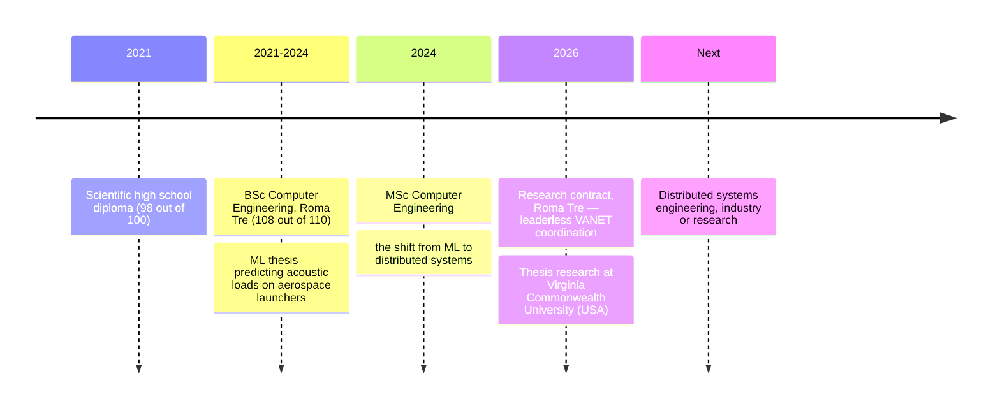

<!--
  ============================================================================
  GitHub Profile README — oligiochi
  Designed as the homepage of a technical portfolio, not a widget gallery.
  Reading funnel: hook → proof (thesis) → more proof (projects) → how I think
  → what I use → where I test it → where I come from → what I want → data.
  ============================================================================
  MAINTENANCE NOTES
  - Widgets adapt to dark/light via <picture> + prefers-color-scheme.
    Palette: accent #58A6FF (dark) / #0969DA (light), muted #8B949E / #57606A.
  - The snake is generated daily by .github/workflows/generate-snake.yml
    (Platane/snk + month/weekday labels) into the "output" branch.
  - Everything marked "CUSTOMIZE:" is yours to keep current.
  ============================================================================
-->

<h1 align="center">Giovanni Oliverio</h1>

  MSc Computer Engineering student · Distributed Systems researcher · Roma Tre University

  <strong>I build systems where no one is in charge — and everything still works.</strong>

  My thesis lets vehicles negotiate parking with no server, no leader, and no consensus round:
  gossip, CRDTs, and Rust. Most of what I build asks the same question at a different scale —
  from vehicular networks down to the rootless containers running my home lab.

  <a href="#the-thesis--parking">Thesis</a> ·
  <a href="#selected-projects">Projects</a> ·
  <a href="https://www.linkedin.com/in/giovanni-oliverio-6419a2329/">LinkedIn</a> ·
  <a href="mailto:oligiovi2@gmail.com">Email</a>

---

## The thesis · ParKing

**Cooperative smart parking for vehicular networks — fully decentralized, leaderless, infrastructure-free.**

Urban parking coordination normally assumes a backend: a server that knows the spots and assigns them. In a VANET that assumption breaks — vehicles come and go, connectivity is intermittent, and any central coordinator is a single point of failure with a coverage problem. ParKing removes the assumption entirely: vehicles share what they know through **epidemic gossip**, merge conflicting views with **CRDTs** (no consensus round needed), and index space with **H3 geospatial cells** so knowledge stays local to where it matters.

- **Stack** — Rust / Tokio for the coordination engine; SUMO + ns-3 (**NR-V2X Mode 2** sidelink) co-simulation for realistic mobility and radio; SLURM / Apptainer for experiments on an HPC cluster.
- **Results** — 92–98% park-rate across scenarios; Bayesian parameter optimization improved the baseline by **+33%** over the sequential benchmark.
- **Research context** — MSc thesis at Roma Tre University in cooperation with **Virginia Commonwealth University** (Richmond, VA), where I spent spring 2026 validating the system experimentally.
- **Status** — thesis in progress, graduating October 2026. The repository is private until publication; the simulation framework it builds on is open: [VaN3Twin](https://github.com/h3-vanet/VaN3Twin), a multi-stack ETSI-compliant V2X framework for ns-3.

## Selected Projects

<!-- CUSTOMIZE: every project follows the same schema —
     Problem → Solution → Tech → Why it matters → Status. Keep it that way. -->

### [GoodMusic](https://github.com/progetto-asw2024/asw-goodmusic) — event-driven microservices, end to end

- **Problem** — decompose a social music platform into services that stay consistent without coupling to each other.
- **Solution** — event-driven architecture on **Kafka**, service discovery with **Consul**, REST APIs on **Spring Boot**; deployed three ways to compare the trade-offs: [Docker Compose](https://github.com/progetto-asw2024/asw-goodmusic-docker), [Kafka-centric](https://github.com/progetto-asw2024/asw-goodmusic-kafka), and [Kubernetes](https://github.com/progetto-asw2024/asw-goodmusic-kubernetes).
- **Tech** — Java, Spring Boot, Kafka, Consul, Docker, Kubernetes.
- **Why it matters** — it's the same distributed-systems thinking as the thesis, applied to the backend stack companies actually run.
- **Status** — complete (Software Architectures course project).

### [cyberSecurity](https://github.com/oligiochi/cyberSecurity) — offensive security, learned by doing

- **Problem** — you can't harden what you can't break.
- **Solution** — a growing collection of solved security exercises and CTF work from **CyberChallenge.IT** (the Italian national cybersecurity program): SQL injection, XSS, command injection, Linux server hardening.
- **Tech** — web security tooling, Docker labs, Linux.
- **Why it matters** — security as a design constraint, not an afterthought — the same least-privilege mindset that shapes my infrastructure work.
- **Status** — actively maintained as I solve new challenges.

### Home Lab — production thinking on home hardware

- **Problem** — run real services, reachable from the internet, without ever granting a container root.
- **Solution** — described in [its own section below](#home-lab), because it earned one.
- **Status** — running 24/7, serving [ildon.me](https://ildon.me).

### [MazeGenKotlin](https://github.com/oligiochi/MazeGenKotlin) — algorithms for fun

Maze generation in **Kotlin** — small, self-contained, and the reason procedural generation still shows up in my side reading. Complete.

## Design Philosophy

<!-- CUSTOMIZE: these are principles with receipts — each one points at real work.
     If you add one, anchor it to something you actually built. -->

- **Leaderless by default.** A central coordinator is a single point of failure wearing a costume. If coordination can emerge from gossip and convergent data structures, it should. *(ParKing)*
- **Measure, don't assume.** Claims about distributed behavior are worthless without experiments — co-simulation, benchmarks, and parameter sweeps come before opinions. *(SUMO + ns-3 on HPC, Bayesian optimization)*
- **Least privilege is hygiene, not paranoia.** If DNS can be served from an unprivileged container, root was never necessary. *(rootless Podman home lab)*
- **The network is part of the design.** Namespaces, routing, and packet filters shape system behavior as much as code does — treating them as "ops details" is how systems surprise you. *(nftables, Linux namespaces, Wireshark)*

## Skills

<!-- CUSTOMIZE: bold = core, used in real projects; plain = working knowledge.
     Text instead of badge walls: denser, searchable, and honest. -->

| | |
|---|---|
| **Languages** | **Rust** (Tokio — thesis daily driver), **Java**, **Kotlin**, **Python**, C, C#, Bash |
| **Distributed systems** | **CRDTs**, **epidemic gossip**, peer-to-peer coordination, microservices, **Kafka**, Consul, VANET / V2X |
| **Backend & data** | **Spring Boot**, REST APIs, SQL, Elasticsearch, Gradle, Maven |
| **DevOps & cloud native** | **Podman (rootless)**, **Docker** / Compose, **Kubernetes**, Jenkins, CI/CD |
| **Networking & security** | **Linux networking** (namespaces, veth, **nftables** NAT/DNAT), TCP/IP, DNS, web security & CTF, server hardening |
| **Simulation & HPC** | **SUMO**, **ns-3 (NR-V2X Mode 2)**, SLURM, Apptainer |

## Home Lab

The lab exists to answer a question I kept running into: **how much "production" can you build without root?**

Everything runs in **rootless Podman** containers on an Ubuntu home server. The forcing function is DNS: **AdGuard Home** must answer on port 53, which an unprivileged process cannot bind — solved with an **nftables DNAT redirect**, so the container serves the whole LAN's DNS with zero system privileges. Services I write myself (including deployments of my [data-engineering projects](https://github.com/orgs/IngegneriaDati/repositories)) are composed with Podman Compose, published through a reverse proxy, and reach the internet through a **Cloudflare Tunnel** on [ildon.me](https://ildon.me) — no ports forwarded, no attack surface volunteered. Remote access goes over VPN.

It is a small system, but it is treated like a real one: least privilege, layered ingress, and every convenience earned rather than granted. This is where the design philosophy above meets actual traffic.

## Journey

<!-- Text fallback for raw-file readers:
     2021 diploma (98/100) → 2021–24 BSc Roma Tre (108/110), ML thesis on
     aerospace launchers → 2024– MSc → 2026 research contract Roma Tre +
     thesis research at VCU (USA) → next: distributed systems engineering. -->

I got into this through **machine learning** — my BSc thesis predicted acoustic loads on aerospace launchers. But what kept pulling at me wasn't the models; it was the systems around them: how computation is distributed, how state converges, what happens when the network misbehaves. The MSc made that the main thread, and the research contract at Roma Tre — then the thesis work at VCU — turned it into my specialty.

## Research

- **Current** — leaderless multi-agent coordination for vehicular networks: gossip protocols, CRDT-based state convergence, and large-scale SUMO + ns-3 co-simulation validated on HPC (with Roma Tre and Virginia Commonwealth University).
- **Academic focus** — MSc Computer Engineering, Roma Tre, graduating October 2026; ML background from the BSc thesis, drawn on when a systems problem genuinely calls for learned components.
- **Next** — decentralized coordination at larger scales: what gossip and CRDTs can replace in infrastructure we currently centralize by habit.

## What I'm Looking For

<!-- CUSTOMIZE: update availability, and add remote/relocation preferences. -->

- **Distributed systems / backend engineering roles** — available from **October 2026**, after graduation.
- **Research collaboration** on decentralized coordination, V2X, or vehicular networking — my thesis tooling and results are open for discussion before publication.
- **Open source** in the same orbit: Rust systems tooling, container runtimes, networking.

Currently deepening: Tokio internals, Kubernetes networking, NR-V2X.

## Activity

  <picture>
    <source media="(prefers-color-scheme: dark)" srcset="https://raw.githubusercontent.com/oligiochi/oligiochi/output/github-contribution-grid-snake-dark.svg">
    
  </picture>
   
  

<strong>GitHub statistics</strong> — stats, streak, languages, activity graph

 

  <picture>
    <source media="(prefers-color-scheme: dark)" srcset="https://github-stats-extended.vercel.app/api?username=oligiochi&show_icons=true&include_all_commits=true&custom_title=GitHub%20Stats%20%C2%B7%20since%20Aug%202019&hide_border=true&bg_color=00000000&title_color=58A6FF&icon_color=58A6FF&text_color=C9D1D9">
    
  </picture>
  <picture>
    <source media="(prefers-color-scheme: dark)" srcset="https://streak-stats.demolab.com?user=oligiochi&hide_border=true&background=0D1117&ring=58A6FF&fire=58A6FF&currStreakNum=C9D1D9&sideNums=C9D1D9&currStreakLabel=58A6FF&sideLabels=8B949E&dates=8B949E">
    
  </picture>
    
  <picture>
    <source media="(prefers-color-scheme: dark)" srcset="https://github-stats-extended.vercel.app/api/top-langs/?username=oligiochi&layout=compact&langs_count=8&custom_title=Top%20Languages%20%C2%B7%20all-time%2C%20public%20repos&hide=jupyter%20notebook,html,css&hide_border=true&bg_color=00000000&title_color=58A6FF&text_color=C9D1D9">
    
  </picture>
    
  <picture>
    <source media="(prefers-color-scheme: dark)" srcset="https://github-readme-activity-graph.vercel.app/graph?username=oligiochi&custom_title=Contribution%20Activity%20%C2%B7%20last%2031%20days&hide_border=true&bg_color=0D1117&color=C9D1D9&line=58A6FF&point=58A6FF&area=true&area_color=58A6FF">
    
  </picture>

## Contact

If you work on distributed systems, vehicular networking, or anything that shouldn't have a single point of failure — let's talk.

  
  &nbsp;&nbsp;
  
  &nbsp;&nbsp;
  

